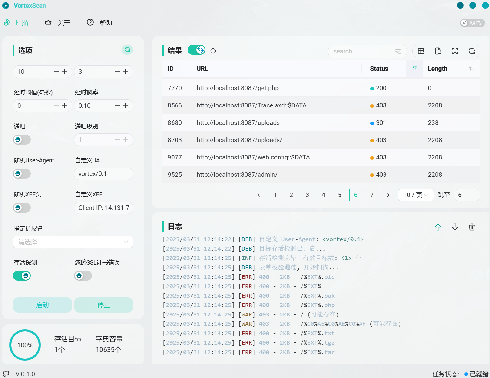

# VortexScan

**基于 Rust + Tauri 的高性能目录扫描工具**
*轻量快速 · 多线程 · 可定制化扫描*

> 部分功能未完成且仍有bug, 精力有限目前优先更新C2，此项目已停滞🤯...

## 🔍 预览

## TODO
* [X] 并发快速扫描，支持设置线程
* [X] 忽略指定的状态码
* [X] 指定扩展名类型扫描，但字典默认为auto时据此以选择
* [ ] 递归扫描，设定级别
* [X] 自行提供字典，以及默认的多字典选择，分为三个级别（默认、自动、top-high)
* [X] 保存全部或所需结果至文件，支持csv, json, txt
* [X] 请求方法设置 HEAD/GET
* [X] 设置随机延时已动态调整请求频率
* [X] 设置代理http/https
* [ ] 添加相似度对比，自动忽略无效路径
* [ ] 存活探测， 可开关控制，(但还需要优化速度)
* [X] 指定cookie
* [X] ua头随机使用以及自定义ua
* [X] 重定向二次扫描
* [X] 头部定义IP信息，随机以及自定义
* [ ] 自动分析 404 特征（响应内容的长度，关键词，html结构）
